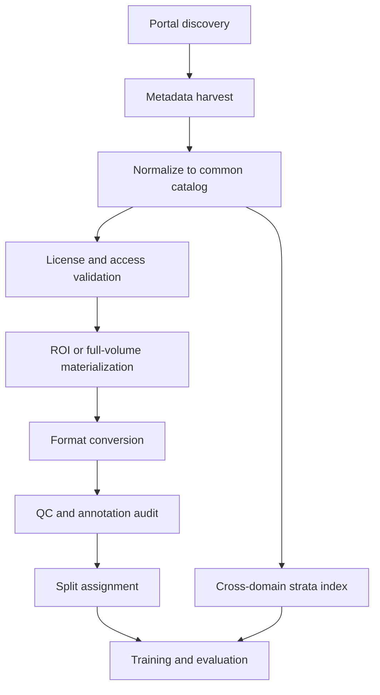
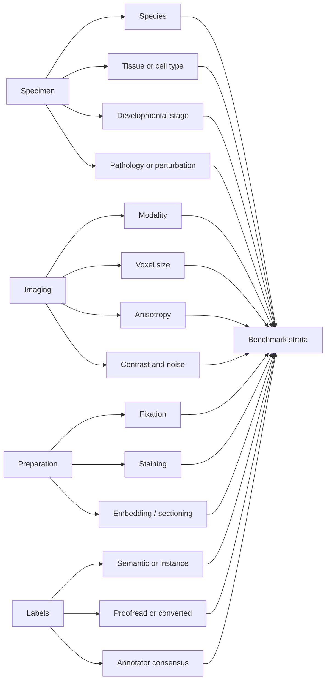

# Designing an Evaluation Benchmark for Generalist 3D Mitochondria Segmentation Models

## Executive summary

A strong benchmark for **generalist 3D mitochondria segmentation** should be built around **volume-level holdouts, cross-domain stress tests, and metadata-rich stratification**, not just pooled train/test accuracy on one or two canonical datasets. The field has moved from single-dataset specialist models on **Lucchi/EPFL** and similar benchmarks toward broader resources such as **MitoEM**, cross-dataset transfer/domain-adaptation studies, multi-organelle EM frameworks, and emerging benchmark efforts such as **MitoEM 2.0** and **MitoVerse3D**. Those later resources make the central benchmark-design lesson explicit: dataset diversity, label consistency, and leakage-free evaluation matter at least as much as architecture choice. citeturn24academia2turn10academia0turn22academia0turn24academia3 fileciteturn0file2 fileciteturn0file3 fileciteturn0file4

For this benchmark, I recommend organizing evaluation along axes that are known to induce domain shift in volume EM: **microscope modality** (FIB-SEM, SBF-SEM, ssSEM/ATUM-SEM, cryo-ET), **species**, **tissue/cell type**, **fixation and staining protocol**, **voxel anisotropy/resolution**, **developmental stage**, and **pathology/experimental perturbation**. The train/validation/test policy should be **volume-level only**, with no patch leakage, plus explicit **leave-one-domain-out** suites for modality, tissue, species, and resolution. citeturn22academia0turn10academia0 fileciteturn0file2 fileciteturn0file3

On metrics, the benchmark should report **voxel overlap** and **instance-level quality** together. A minimal reporting bundle is: **Dice**, **IoU**, **precision/recall**, **AP50/AP75/AP@[.50:.95]**, **AJI**, **PQ/SQ/RQ**, and a **boundary or surface metric**; for topological robustness, add a centerline/topology-aware score such as **clDice** or an explicit merge/split analysis. Panoptic-style evaluation is particularly attractive because it jointly reflects recognition and delineation quality, while recent evaluation tooling such as **Panoptica** makes 3D instance-wise scoring easier to standardize. citeturn33academia2turn32academia2turn33academia1 fileciteturn0file2 fileciteturn0file3

Operationally, the safest public-data acquisition backbone today is: **EMPIAR** for policy-stable archival and CC0 access, **MICrONS** for release manifests and evolving proofreading tables, **NeuroData/Open Connectome** for AWS-hosted Neuroglancer-precomputed volumes and cutouts, and **publication-tied repositories** such as EPFL, GitHub, institutional servers, Zenodo, and Dryad for long-tail diversity. Where portals are JS-heavy or cloud-path-based, use **metadata-first scraping**, **cutout-first download**, and **per-record license validation** rather than indiscriminate mirroring. citeturn3view2turn27view0turn4view0turn47view0turn39view0turn41view0 fileciteturn0file1

## Literature landscape

The literature relevant to a **generalist benchmark** falls into three overlapping groups: **domain-specific 3D EM mitochondria segmentation papers**, **transferable/generalist EM segmentation frameworks**, and **evaluation/benchmark methodology papers**. The most useful papers for benchmark design are not always the most accurate segmentation papers; many of the highest-value papers are the ones that expose **dataset bias**, **cross-domain fragility**, or **evaluation pitfalls**. citeturn10academia0turn24academia2turn22academia0turn32academia2 fileciteturn0file2 fileciteturn0file3 fileciteturn0file4

| Paper | Why it matters for this benchmark | Datasets used | Strengths | Limitations | Official page / PDF |
|---|---|---|---|---|---|
| **Wei et al., MitoEM** | Seminal large-scale mammalian **3D mitochondria instance benchmark**; established MitoEM-H and MitoEM-R as standard public references. | Human and rat cortex ssSEM | Big step beyond Lucchi scale; instance labels; biologically diverse mitochondrial morphologies. | Still concentrated in mammalian cortex; not a full generalization benchmark. | Survey summary and benchmark reference. fileciteturn0file4 fileciteturn0file2 |
| **Xiao et al., 2018** | Early influential **3D supervised CNN** for EM mitochondria segmentation; good historical baseline. | Rat cortex ssSEM; Lucchi FIB-SEM | Demonstrated benefit of hybrid 2D/3D context across isotropic and anisotropic EM. | Small-scale compared with later datasets; limited out-of-domain scope. | Survey summary. fileciteturn0file4 |
| **Casser et al., 2018 / Fast Mitochondria Detection for Connectomics** | Seminal **fast U-Net-style specialist baseline** and **Lucchi++** corrected annotations. | EPFL/Lucchi, Lucchi++, others | Reproducible, efficient, still useful as a strong classical baseline. | Optimized around narrow-domain specialist data. | citeturn25academia1 |
| **Yuan et al., EM-NET** | Representative of **shape-aware** mitochondria segmentation; useful for understanding centerline-aware inductive bias. | Public mitochondria benchmarks | Improved discontinuity handling and sample efficiency. | Still benchmarked on a small number of datasets. | citeturn25academia0 |
| **Franco-Barranco et al., Stable deep neural network architectures** | Important for **reproducibility**: compares architectures under controlled preprocessing/postprocessing and repeated runs. | EPFL, Lucchi++, Kasthuri++ | Benchmark-minded; emphasizes fair comparison and stable recipes over novelty claims. | Focused on a small set of public datasets, mostly older EM benchmarks. | citeturn24academia2 |
| **Franco-Barranco et al., Domain adaptation for mitochondria segmentation** | Directly relevant to **generalist evaluation**: cross-dataset transfer and target-domain adaptation. | Three public EM mitochondria datasets | Shows cross-domain performance drops and gains from UDA/self-supervision/multi-task training; proposes morphology-based stopping criterion. | Transfer still studied on a limited set of domains. | citeturn10academia0 |
| **Xiao et al., 2022 / semi-supervised spatial continuity** | Useful for **label-scarcity protocols** and weak-label benchmark tracks. | EPFL/Lucchi-like FIB-SEM | Shows competitive performance with much less annotation by exploiting spatial continuity. | Evidence mostly from a narrow benchmark regime. | citeturn31academia3 |
| **Li et al., 2021 / contrastive learning** | Important for **representation learning** under hard examples and noisy EM boundaries. | MitoEM and FIB-SEM datasets | Demonstrates feature-learning gains on difficult mitochondria boundaries. | Still specialist rather than broad generalist evaluation. | citeturn14academia4 |
| **Thawakar et al., STT-UNET** | Example of newer **transformer-hybrid 3D instance segmentation** evaluated on multiple mitochondria benchmarks. | Lucchi, MitoEM-R, MitoEM-H | Strong recent specialist performance; models long-range context. | Still evaluated on a narrow benchmark trio, not true leave-domain-out generalization. | citeturn24academia4 |
| **PyTorch Connectomics** | General EM training/evaluation framework that supports organelles including mitochondria. | Multiple EM tasks and datasets | Practical for benchmark baselines, semi-supervision, and standardized training loops. | Framework paper, not itself a benchmark specification. | citeturn24academia3 |
| **MitoEM 2.0** | The most benchmark-relevant recent resource in your materials: explicitly broadens modality, tissue, and species diversity and introduces challenge-focused evaluation structure. | Multi-source vEM datasets across FIB-SEM, SBF-SEM, ssSEM | Strongest direct template for a **generalist 3D mitochondria benchmark**. | Working manuscript; some public packaging details may still change before final release. | Uploaded manuscript. fileciteturn0file2 |
| **MitoVerse3D** | Benchmark-suite framing with standardized splits, baseline instance pipeline, and QC recommendations. | Curated multi-species / multi-tissue EM volumes | Good for benchmark packaging, proofread labels, and baseline evaluation stack. | Appears to be a draft/working document; some catalog entries are placeholders. | Uploaded manuscript. fileciteturn0file3 |
| **Panoptic Segmentation / PQ** | Foundational for instance-aware evaluation design. | General vision | PQ unifies recognition and segmentation quality; useful for mitochondria instance benchmarking. | Natural-image origin; must be adapted thoughtfully for biomedical edge cases. | citeturn33academia2 |
| **Panoptica** | Practical **3D instance-wise evaluation toolkit**. | Biomedical segmentation tasks | Makes 3D PQ-like and instance-wise evaluation easier to standardize. | Tooling paper; metric choice still requires task-specific policy. | citeturn32academia2 |
| **nnU-Net Revisited** | Not mitochondria-specific, but highly relevant for **benchmark rigor** and avoiding weak baselines. | Broad 3D medical segmentation benchmarking | Strong caution against inadequate baselines, insufficient datasets, and unfair comparisons. | Domain is broader than EM organelle segmentation. | citeturn22academia0 |

The highest-confidence conclusion from this literature is simple: for a generalist benchmark, **the most valuable leaderboard is not the one with the single highest pooled Dice, but the one that exposes which methods survive domain shift**. That conclusion is supported by the domain-adaptation paper, the stability/reproducibility work, the recent benchmark manuscripts, and the broader validation critique in nnU-Net Revisited. citeturn10academia0turn24academia2turn22academia0 fileciteturn0file2 fileciteturn0file3

## Public dataset inventory

The table below focuses on **public volume EM datasets that include mitochondria annotations**, either as mitochondria-only labels or as one class in a larger organelle/cellular annotation set. Where official landing pages are not easily machine-readable, the URL and dimensional metadata are taken from the survey and should be **validated against the current repository manifest before bulk download**. citeturn3view2turn39view0 fileciteturn0file4

| Dataset | Modality | Species | Tissue / cell type | Voxel size | Volume dimensions | Annotation type | License / access | Download URL | Representative source |
|---|---|---|---|---|---|---|---|---|---|
| **Lucchi / EPFL Hippocampus** | FIB-SEM | Mouse | Hippocampus | 5×5×5 nm | 1024×768×165 | Semantic mitochondria | Public download; check site terms | `https://www.epfl.ch/labs/cvlab/data/data-em/` | Survey table. fileciteturn0file4 |
| **Lucchi++** | FIB-SEM | Mouse | Hippocampus | 5×5×5 nm | 1024×768×165 | Corrected semantic mitochondria | Public download; check site terms | `https://casser.io/connectomics` | Survey table; Casser dataset page. fileciteturn0file4 |
| **MitoEM-H** | ssSEM | Human | Cortex | 8×8×30 nm | 4096×4096×1000 | **Instance** mitochondria | Public challenge data; terms on challenge site | `https://mitoem.grand-challenge.org/` | Survey table; MitoEM benchmark manuscript. fileciteturn0file4 fileciteturn0file2 |
| **MitoEM-R** | ssSEM | Rat | Cortex | 8×8×30 nm | 4096×4096×1000 | **Instance** mitochondria | Public challenge data; terms on challenge site | `https://mitoem.grand-challenge.org/` | Survey table; MitoEM benchmark manuscript. fileciteturn0file4 fileciteturn0file2 |
| **Xiao rat cortex dataset** | ssSEM / ATUM-style serial sections | Rat | Cortex | 2×2×50 nm | 8624×8416×20 | Semantic mitochondria | Public institutional server; long-term stability should be checked | `http://95.163.198.142/MiRA/mitochondria31/` | Survey table. fileciteturn0file4 |
| **UroCell** | FIB-SEM | Mouse | Urothelial cells | 16×16×15 nm | 5 subvolumes of 256×256×256 | Semantic multi-organelle including mitochondria | Public GitHub; inspect repo license | `https://github.com/MancaZerovnikMekuc/UroCell` | Survey table. fileciteturn0file4 |
| **Cardiac mitochondria** | FIB-SEM | Mouse | Heart muscle / cardiomyocyte | 15×15×15 nm | 1728×2022×100 | Semantic mitochondria | Public supplemental file; license not explicit on landing page | `http://labalaban.nhlbi.nih.gov/files/SuppDataset.tif` | Survey table. fileciteturn0file4 |
| **Perez SCN dataset** | SBF-SEM | Mouse | Brain, suprachiasmatic nucleus | 7.8×7.8×30 nm | 16000×12000×1283 | Semantic multi-organelle including mitochondria | Public institutional release; inspect site terms | `https://www.sci.utah.edu/releases/chm_v2.1.367/` | Survey table. fileciteturn0file4 |
| **Guay dense-cell platelets** | SBF-SEM | Human | Platelets | 10×10×50 nm | 800×800×50 | Dense cell/organelle labels incl. mitochondria | Public project page; inspect dataset terms | `https://leapmanlab.github.io/dense-cell/` | Survey table. fileciteturn0file4 |
| **Axon white matter** | SBF-SEM | Mouse / rat white matter in survey context | White matter | 50×50×50 nm | 1000×1000×3250 | Multi-class incl. mitochondria | Public challenge page | `http://segem.brain.mpg.de/challenge/` | Survey table. fileciteturn0file4 |
| **CDeep3M-S** | SBF-SEM | Mouse | Brain | 2.4×2.4×24 nm | 16000×10000×400 | Multi-class incl. mitochondria | Public code/data links; inspect repo terms | `https://github.com/CRBS/cdeep3m` | Survey table. fileciteturn0file4 |
| **OpenOrganelle atlas** | FIB-SEM | Mixed (human/mouse/cell lines) | HeLa, macrophage, T cells, others | 8×8×8 nm in survey examples | Varying sizes | Multi-organelle semantic masks including mitochondria | Public Janelia portal; per-dataset terms should be checked | `https://openorganelle.janelia.org/` | Survey table; MitoFoundation source list. fileciteturn0file4 fileciteturn0file1 |
| **Cellular cryo-ET PC12** | Cryo-ET | Rat cell line | PC12 cells | 2.8×2.8×2.8 nm | 938×938×938 | Multi-organelle incl. mitochondria | Public EMDB/EMPIAR ecosystem page; verify raw/derived asset layout | `https://www.ebi.ac.uk/emdb/EMD-8594` | Survey table. fileciteturn0file4 |

A few practical conclusions fall out of this inventory. **Lucchi/Lucchi++** remain useful for fast iteration and sanity checks, but they are too narrow to stand alone as a “generalist” benchmark. **MitoEM-H/R** are the best currently established public instance-segmentation anchors. The strongest additions for generalization are **OpenOrganelle**, **UroCell**, **cardiac muscle**, **platelets**, and **SBF-SEM brain** data, because they diversify both **biology** and **image formation**. Cryo-ET is worth including as a separate transfer track, but it should not be merged into the primary leaderboard without caveats because its noise model and reconstruction artifacts differ substantially from vEM. citeturn27view0 fileciteturn0file2 fileciteturn0file4

## Portals, repositories, and access strategy

For broad but disciplined coverage, a benchmark build-out should not rely on one portal. It should combine **archival repositories**, **live data portals**, and **publication-linked long-tail repositories**. The best sources differ in what they optimize: archival stability, programmatic access, proofreading support, or diversity of biological content. citeturn3view2turn39view0turn4view0turn47view0 fileciteturn0file1

| Portal / repository | Why include it | Best access method | What to scrape / cache first | Legal / ethical considerations |
|---|---|---|---|---|
| **EMPIAR** | Archival, policy-governed public repository for raw EM, including **volume EM** entries; supports FIB-SEM, SBF-SEM, ATUM-SEM, ssET, and benchmark/reference datasets. | Start from the portal and its **REST API**; use release metadata first, then FTP/archive download as needed. | Accession, title, modality, voxel size, linked publication/EMDB, file manifests, derived segmentations if present. | EMPIAR states data are **freely available under CC0**; still respect repository load, mirror options, and citation norms. citeturn3view2turn27view0 |
| **MICrONS Explorer** | Excellent for **release manifests**, evolving proofreading metadata, and community-facing access to a major cortical dataset. | Scrape **manifests** and release notes first; use table-based data products for annotations; use CAVE-linked resources for structured access. | Release version, proofreading tables, annotation tables, dataset pages, datastack metadata references. | Terms page states **CC BY 4.0** with attribution per citation policy. Some metadata services require login; VORTEX annotations are shared publicly on release. citeturn4view0turn28view1turn47view0 |
| **NeuroData / Open Connectome** | Good for **raw hosted data on AWS**, clean cutout workflows, and Neuroglancer-precomputed access. | Use AWS listing plus **CloudVolume** cutouts rather than full mirroring. | Bucket paths, dataset names, voxel metadata, useful example cutout coordinates, publication links. | Public/open access, but budget bandwidth and prefer ROI cutouts over blind downloads. citeturn39view0turn41view0 |
| **OpenOrganelle** | High-value source for **whole-cell and tissue FIB-SEM organelle labels** beyond neuroscience. | Metadata-first; portal/manual manifest resolution first, then cloud-path or ROI materialization. | Cell/tissue identity, voxel size, label channels, cloud path, segmentation provenance. | Public portal, but the static crawl does not expose terms cleanly; verify per-dataset permissions before bulk download. citeturn3view1 fileciteturn0file1 fileciteturn0file4 |
| **BossDB ecosystem** | Useful when volumes or derived masks are hosted as cloud-native subvolumes and when cutout-based workflows are preferable. | Prefer documented cutouts/APIs through the surrounding portal/toolchain instead of ad hoc HTML scraping. | Dataset collection names, channel names, spatial bounds, chunk size, permissions. | Confirm authentication/rate limits and project-level citation requirements before automated harvesting. NeuroData and MICrONS both reference BossDB-hosted assets in practice. citeturn39view0turn40view0turn47view0 fileciteturn0file1 |
| **FlyEM / Janelia** | Valuable for nervous-system diversity and Janelia-hosted EM assets. | Prefer direct dataset artifacts or publication-linked resources over generalized site scraping. | Dataset identifiers, tarball paths, publication links, volume metadata. | Public, but dataset-specific terms and formats vary. Survey lists direct artifact URLs such as FIB-25. fileciteturn0file4 |
| **Zenodo / Dryad / institutional servers** | Essential for long-tail diversity: supplemental datasets, thesis-linked releases, niche tissues, and community benchmarks. | DOI-first ingestion: scrape landing-page metadata, file manifests, and licenses per record. | DOI, creators, publication link, license, file list, checksum, update/version date. | Terms differ by record. Dryad is generally CC0 at the dataset level; institutional servers often have weaker machine-readable licensing and need manual review. citeturn44search0turn44search2 |

The safest technical pattern is therefore **metadata-first, cutout-first, and license-first**. In practice: build a normalized catalog first; store accession, DOI, file manifest, voxel sizes, and license metadata; then materialize only benchmark-candidate ROIs. This avoids bulk downloading of unusable or legally ambiguous volumes and fits the staged acquisition approach described in the MitoFoundation thesis. citeturn27view0turn41view0turn47view0 fileciteturn0file1

A practical benchmark ingestion architecture can be summarized as follows:

## Benchmark dataset design

A generalist benchmark should be designed around **heterogeneity that is biologically and technically meaningful**, not arbitrary dataset count. The most important stratification axes are the ones that plausibly alter mitochondrial appearance, continuity, or separability: **modality**, **species**, **tissue/cell type**, **sample preparation** (fixation, heavy-metal staining, embedding), **voxel resolution/anisotropy**, **developmental stage**, **pathology or perturbation**, and **label provenance** (native instance labels versus converted semantic labels versus newly annotated labels). These are exactly the axes emphasized by the recent benchmark drafts and by the broader EM survey. citeturn27view0turn3view2 fileciteturn0file2 fileciteturn0file3 fileciteturn0file4

My recommendation is to define **three complementary benchmark tracks**:

**Core pooled benchmark.** Train on a diverse pooled training set, validate on held-out volumes spanning the same domains, and test on a balanced set across all strata. This is the “how good is your average system?” track. It should be the default leaderboard, but not the only one. citeturn22academia0 fileciteturn0file2

**Cross-domain generalization benchmark.** Provide fixed suites such as **leave-one-modality-out**, **leave-one-species-out**, **leave-one-tissue-out**, and **leave-one-resolution-band-out**. This is the real test of “generalist” behavior. The domain-adaptation paper strongly motivates this style of evaluation because it shows large performance loss when moving across source and target distributions. citeturn10academia0

**Low-label adaptation benchmark.** Include semi-supervised or few-shot tracks in which only a small labeled subset is available in the target domain. This reflects actual vEM practice, where full manual annotation is expensive and ROI-specific. citeturn31academia3turn10academia0

The split policy should be conservative:

- **Never split at the patch level** when source patches come from the same original volume.
- **Split at the volume level**, and where possible at the **specimen/session/lab level**.
- Keep all downsampled, augmented, or cropped derivatives of a source volume in the **same split**.
- Use **fixed public coordinates/manifests** for benchmark ROIs.
- Require methods to declare whether they used **external pretraining**, **target-domain unlabeled data**, or **test-time adaptation**. citeturn22academia0 fileciteturn0file2 fileciteturn0file3

The following **minimum floors** are my design recommendations, synthesized from the literature and the data reality of public EM rather than copied from a single published standard:

| Stratum type | Recommended floor |
|---|---|
| Primary benchmark stratum | **≥3 independent volumes** if publicly available; if not possible, use **1–2 volumes** only as an auxiliary domain and do not over-weight it in macro averaging |
| Instance-rich test stratum | **≥250–500 mitochondria instances** or enough annotated volume to stabilize AP/PQ estimates |
| Agreement/QC subset | **10–20% of volumes** independently reviewed by a second annotator |
| Cross-domain holdout | At least **one completely unseen domain** per axis of interest: one modality, one tissue, one species, one resolution band |
| Challenge ROI size | Prefer ROIs large enough to include long mitochondria, branch points, crowded contacts, and boundary truncation cases; in practice **128³–256³ isotropic** or anisotropy-aware equivalents are usually workable |

These floors are intentionally pragmatic: current public data are still too sparse to support perfectly balanced strata in every modality and tissue, especially once you insist on high-quality instance labels. The benchmark should therefore use **macro-averaging across domains** and **explicit imbalance disclosures** instead of pretending the catalog is fully uniform. citeturn22academia0turn10academia0 fileciteturn0file2 fileciteturn0file3

## Annotation standards and quality control

Annotation design is where many otherwise promising benchmarks fail. For mitochondria, the benchmark should require a clean separation between **semantic foreground/background**, **instance identity**, and **uncertain / ignore** regions. Background should be `0`, each mitochondrion should get a **globally unique integer instance ID within a volume**, and ambiguous voxels should be represented explicitly rather than silently forced into foreground or background. Both MitoVerse3D and MitoEM-style pipelines emphasize expert proofreading, unique IDs, and volume-level consistency across slices. fileciteturn0file2 fileciteturn0file3

For file formats, the most future-proof pattern is to store benchmark truth in **OME-Zarr** (or another chunked cloud-friendly array format) with a thin compatibility export to **NIfTI/TIFF/HDF5** for legacy pipelines. OME-Zarr was developed precisely to support scalable, chunked, cloud-optimized multidimensional imaging, while the recent benchmark drafts already envision HDF5/Zarr-style scalable storage. citeturn45search2turn45search3 fileciteturn0file3

A benchmark-ready label package should include, at minimum:

| Required element | Why it matters |
|---|---|
| Raw image volume | Primary input |
| Instance label volume | Required for AP/AJI/PQ evaluation |
| Semantic mask | Useful for semantic tracks and QC |
| Voxel size in nanometers | Needed for resampling and surface metrics |
| Modality, tissue, species, specimen metadata | Required for stratified analysis |
| Annotation provenance | Native instance labels, converted labels, or newly annotated |
| Split manifest | Prevents leakage and benchmark drift |
| Optional ignore mask | Prevents unfair penalization at uncertain borders |

Quality control should be multi-layered. The most reliable workflow combines **model-assisted pre-segmentation**, **expert proofreading**, **independent secondary review on a subset**, and automated sanity checks for **duplicate labels**, **non-integer labels**, **floating fragments**, and suspicious morphology outliers. The MitoVerse3D and MitoEM2.0 manuscripts explicitly describe **VAST Lite** and **Neuroglancer**-based proofreading pipelines, while MICrONS’ VORTEX program shows a mature operational model in which proofreading and annotations are integrated back into public releases and exposed through structured services and file dumps. fileciteturn0file2 fileciteturn0file3 citeturn47view0

For inter-annotator agreement, I recommend reporting at least:

- **Instance IoU** on matched objects
- **Boundary F1**
- **AJI or PQ** on the dual-annotated subset
- **Merge / split counts per volume**
- **Object-count agreement** and size-stratified disagreement rates

MitoVerse3D’s draft validation section uses **instance IoU** and **boundary F1** for a doubly reviewed subset, which is the right general pattern even if the final benchmark adopts slightly different thresholds. fileciteturn0file3

## Metrics and reporting protocol

A good leaderboard for generalist 3D mitochondria segmentation should be **multi-metric by design**. Region overlap metrics are necessary but not sufficient; they hide merge errors, split errors, topological breaks, and boundary drift. The point of reporting more than one family of metrics is not to overwhelm the reader, but to make failure modes legible. citeturn32academia2turn22academia0turn33academia1turn33academia2

| Metric family | Recommended metrics | Why include it |
|---|---|---|
| Voxel / semantic overlap | **Dice**, **IoU**, precision, recall | Standard, interpretable, useful for semantic tracks |
| Instance detection / delineation | **AP50**, **AP75**, **AP@[.50:.95]**, instance F1 | Reflects object-level recovery and localization |
| Biomedical instance aggregate | **AJI** | Punishes fragmented and merged instances more strongly than plain Dice |
| Panoptic | **PQ**, plus **SQ** and **RQ** | Unified view of segmentation quality and recognition quality; very useful for crowded mitochondria |
| Boundary / surface | **Boundary F1**, **ASSD**, optionally **HD95** | Sensitive to contour quality and over-smoothing |
| Topology / connectivity | **clDice**, merge / split counts, connected-component error | Important for long, thin, or “string-of-pearls” mitochondria |
| Robustness | Per-stratum macro average, worst-domain score, CI via bootstrap | Prevents a method from looking “generalist” only because it dominates easy strata |

The reporting protocol should be fixed in advance:

- Report **per-dataset**, **per-stratum**, and **macro-averaged** results.
- Report both **native-resolution** and **common-grid** evaluation if resampling is used.
- Publish the **post-processing recipe**; do not allow hidden test-time tuning per dataset.
- Include **runtime, memory footprint, and crop size**.
- Include **confidence intervals** via bootstrap over volumes.
- Publish a **failure sheet** with representative merge, split, miss, and hallucination cases. citeturn22academia0turn32academia2 fileciteturn0file2 fileciteturn0file3

For a challenge-style benchmark, I would make the **primary ranking metric** a **macro-averaged panoptic score** over held-out domains, then require a secondary table with **Dice**, **AP75**, **AJI**, and **boundary F1**. That combination is hard to game and makes biologically meaningful errors visible. This is a recommendation, but it is well aligned with the panoptic literature, 3D evaluation tooling, and current EM instance-benchmark practice. citeturn33academia2turn32academia2 fileciteturn0file2 fileciteturn0file3

## Practical collection plan and open challenges

The collection plan below prioritizes **diversity first**: different modalities, anisotropy regimes, species, and tissues. Storage estimates are **order-of-magnitude acquisition budgets** based on published volume dimensions and single-channel raw-image assumptions; actual transferred size will vary with file format, compression, multiscale pyramids, and whether labels are stored as `uint16`/`uint32`. For portal-based resources with variable whole-volume sizes, I recommend **ROI-first acquisition** instead of whole-volume mirroring. citeturn41view0turn45search2 fileciteturn0file2 fileciteturn0file4

| Priority target | Diversity value | Public identifier / source | URL | Rough storage budget | Preprocessing recommendation |
|---|---|---|---|---|---|
| **Lucchi++** | Canonical isotropic FIB-SEM baseline | Lucchi++ | `https://casser.io/connectomics` | ~0.12 GiB raw image; labels small-to-moderate | Keep native 5 nm grid; export OME-Zarr; 128³ patches |
| **MitoEM-H** | Human cortex, anisotropic ssSEM, instance labels | MitoEM-H | `https://mitoem.grand-challenge.org/` | ~15.6 GiB raw image; labels larger | Keep native and resampled versions; anisotropy-aware patches such as 256×256×32/64 |
| **MitoEM-R** | Rat cortex complement to human | MitoEM-R | `https://mitoem.grand-challenge.org/` | ~15.6 GiB raw image; labels larger | Same as MitoEM-H |
| **Xiao rat cortex** | Older serial-section domain with different contrast/resolution | mitochondria31 | `http://95.163.198.142/MiRA/mitochondria31/` | ~1.35 GiB raw image | Preserve native z anisotropy; avoid isotropic resampling-only evaluation |
| **UroCell** | Mouse urothelium, non-neural FIB-SEM | 5 public cubes | `https://github.com/MancaZerovnikMekuc/UroCell` | ~0.08 GiB raw for five 256³ cubes | Convert to unified label schema; treat each cube as independent volume |
| **Cardiac mitochondria** | Muscle-specific mitochondrial geometry | supplemental TIFF | `http://labalaban.nhlbi.nih.gov/files/SuppDataset.tif` | ~0.32 GiB if stored 16-bit; smaller if 8-bit | Verify dtype and spacing; preserve isotropic 15 nm |
| **Perez SCN** | Large SBF-SEM brain tissue with multi-organelle labels | Utah release | `https://www.sci.utah.edu/releases/chm_v2.1.367/` | Very large if full stack; ~229 GiB raw 8-bit-equivalent | Do **ROI-first cutouts**; curate benchmark subvolumes rather than whole-volume training |
| **Guay dense-cell platelets** | Human platelet morphology, dense cellular crowding | dense-cell | `https://leapmanlab.github.io/dense-cell/` | Small-to-moderate | Convert organelle labels; include as hard crowded-cell domain |
| **Axon white matter** | Low-resolution SBF-SEM with mitochondria in white matter | SegEM/Axon challenge | `http://segem.brain.mpg.de/challenge/` | Large; use cutouts | Use as low-resolution robustness domain |
| **CDeep3M-S** | Multi-class mouse brain SBF-SEM including mitochondria | CDeep3M-S | `https://github.com/CRBS/cdeep3m` | Large | Useful as auxiliary domain; verify label extraction path |
| **OpenOrganelle HeLa ROI** | Non-neural human cell-line FIB-SEM | OpenOrganelle HeLa entry | `https://openorganelle.janelia.org/` | Plan **0.25–5 GiB per ROI** | Metadata-first; materialize benchmark ROIs only |
| **OpenOrganelle macrophage ROI** | Immune-cell morphology, non-neural | OpenOrganelle macrophage entry | `https://openorganelle.janelia.org/` | Plan **0.25–5 GiB per ROI** | Same ROI-first workflow |
| **OpenOrganelle T-cell ROI** | Lymphocyte / Jurkat-like morphology | OpenOrganelle T-cell entry | `https://openorganelle.janelia.org/` | Plan **0.25–5 GiB per ROI** | Same ROI-first workflow |
| **Cellular cryo-ET PC12** | Separate cryo-ET transfer track | EMD-8594 | `https://www.ebi.ac.uk/emdb/EMD-8594` | Moderate | Keep separate from main vEM leaderboard; evaluate transfer explicitly |

A robust preprocessing recipe should be standardized and published with the benchmark:

1. **Metadata audit.** Parse voxel sizes, orientation, dtype, and provenance first; store them in a normalized catalog. citeturn41view0turn47view0 fileciteturn0file1  
2. **Intensity normalization.** Use robust percentile clipping and per-volume standardization; avoid aggressive histogram matching across domains because it can erase useful acquisition differences. The benchmark drafts and EM survey both mention normalization and, where needed, mild denoising/alignment steps. fileciteturn0file3 fileciteturn0file4  
3. **Dual representation.** Store both **native resolution** and a **common resampled grid** for training convenience, but score the primary benchmark at native resolution where possible. citeturn22academia0 fileciteturn0file2  
4. **Cloud-friendly packaging.** Convert to **OME-Zarr** or an equivalent chunked representation with immutable split manifests. citeturn45search2turn45search3  
5. **Patch extraction.** Use anisotropy-aware patching: roughly **128³–192³** for isotropic FIB-SEM; **256×256×32/64** or similar for anisotropic ssSEM/SBF-SEM.  
6. **Label audit.** Recompute connected components, check for duplicate IDs, confirm zero-background convention, and flag slices with suspicious fragmentation. fileciteturn0file2 fileciteturn0file3  

The main risks and open challenges are not architectural; they are benchmark-engineering problems:

- **Label heterogeneity.** Public resources mix native instance labels, semantic masks, semi-automatic proofreading, and converted annotations. A benchmark must track provenance explicitly or it will compare methods against inconsistent ground truth. fileciteturn0file2 fileciteturn0file3  
- **Domain imbalance.** Public EM still over-represents neural tissue and under-represents pathology, developmental stages, and some modalities. A pooled leaderboard can therefore overstate “generalist” performance. citeturn10academia0turn22academia0 fileciteturn0file4  
- **Portal brittleness.** Some high-value sources are JS-heavy, access-controlled, or updated continuously; manifests and version pinning are essential. MICrONS explicitly evolves through new public releases and proofreading tables. citeturn4view0turn47view0  
- **License ambiguity outside archival repositories.** EMPIAR is clear and permissive; institutional servers and challenge pages are less consistent, so every source should be whitelisted only after terms review. citeturn27view0turn28view1  
- **Metric instability on tiny or truncated objects.** AP and PQ can fluctuate on small-instance or border-heavy volumes; publish size-stratified metrics and ignore-border policies. citeturn32academia2turn33academia2  
- **Cryo-ET versus vEM mismatch.** Cryo-ET is scientifically valuable but technically distinct enough that it should probably be a separate transfer track, not silently merged into the main benchmark. fileciteturn0file4  

On present evidence, the most rigorous benchmark design is therefore a **versioned, metadata-rich, volume-level, multi-domain benchmark** with a **core pooled leaderboard**, a **cross-domain generalization suite**, and a **low-label adaptation track**. That design is the closest match to how mitochondria segmentation will actually be used in heterogeneous 3D EM workflows. citeturn10academia0turn22academia0turn32academia2 fileciteturn0file1 fileciteturn0file2 fileciteturn0file3
